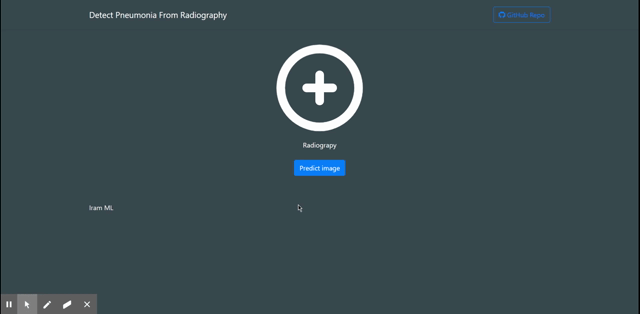

# pneumonia-radiography-detector

Pneumonia and COVID detector developed python and tensorflow, flask as a backend and Angular frontend

## Setup

Train model
1. Install this [Radiography database](https://www.kaggle.com/tawsifurrahman/covid19-radiography-database)
    1. Then put on training/in folder
    2. Rename the dataset folder to images-dataset 
2. Using pip install requirements.txt
3. Inside training folder run on terminal `python main.py`

API
1. Inside api folder set FLASK_APP var to main.py
    1. If you are on Windows `set FLASK_APP=main.py`
    2. If you are on Mac/Linux `export FLASK_APP=main.py`
2. Run `flask run`

Angular predictor website
1. You need to have the [angular cli](https://cli.angular.io/) installed
2. Inside /frontend folder run `ng serve` for a dev server. 
3. Navigate to `http://localhost:4200/`. The app will automatically reload if you change any of the source files.